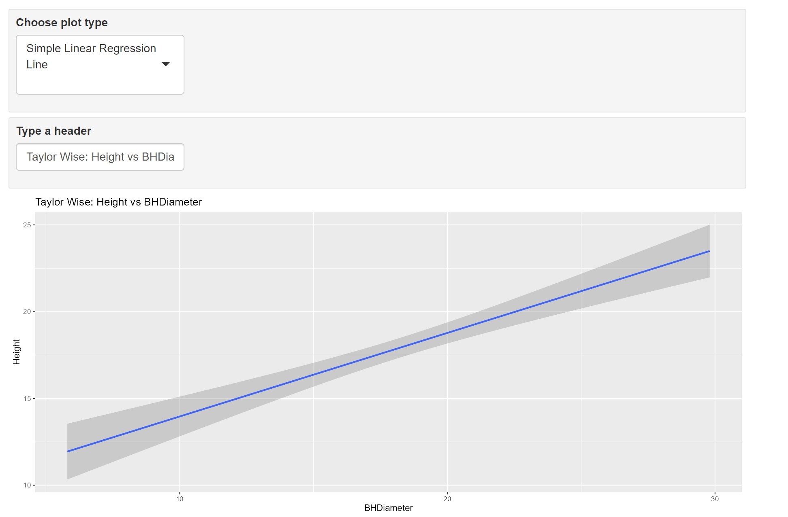
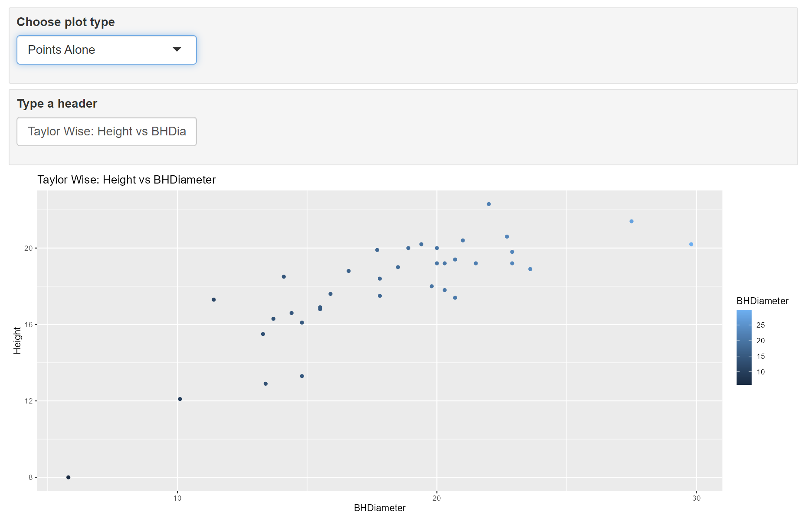
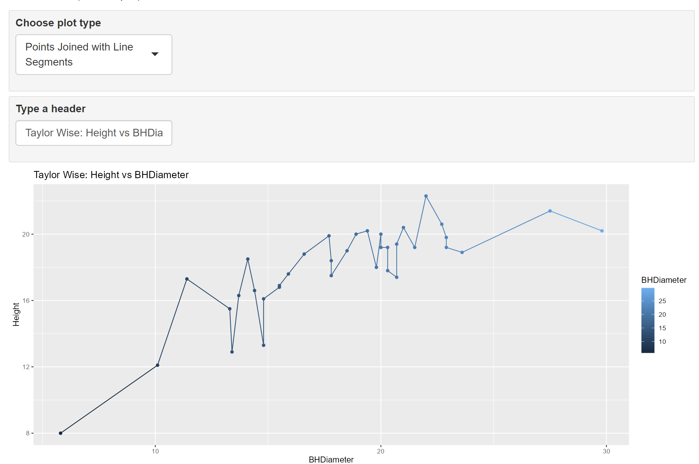

```{r setup, include=FALSE}
knitr::opts_chunk$set(echo = TRUE)
```

# Tasks

## Task 1
Get working directory
```{r}
getwd()
```

## Task 2
Reading in the file and show the first 6 lines of data
```{r}
spruce <- read.csv("SPRUCE.csv")
head(spruce)
```

## Task 3
<!--
use cex=1.2
-->
Scatter Plot of Height VS BHDiameter
```{r}
with(spruce, plot(BHDiameter, Height, pch=21, bg="Blue", main = "Scatter Plot of Height (m) vs BHDiameter (cm)", cex=1.2), xlim=c(0,1.1 * max_x), ylim = c(0, 1.1 * max_y))
```

Based on the graph above, there does not appear to be a straight line relationship
<!--
spruce$Height, spruce$BHDiameter can also be used in trendscatter
-->

Make lowess smoother scatter plots with values f=0.5,0.6,0.7 respectively
```{r}
library(s20x)

layout(matrix(1:3, nrow=3, ncol=1))

trendscatter(Height~BHDiameter, data=spruce, f=0.5)

trendscatter(Height~BHDiameter, data=spruce, f=0.6)

trendscatter(Height~BHDiameter, data=spruce, f=0.7)
```

Assume a straight line relationship

Make a linear model object (spruce.lm) and then make a scatter plot with a least squares regression line
```{r}
spruce.lm <- lm(Height~BHDiameter, data = spruce)

with(spruce, plot(BHDiameter, Height, pch=21, bg="Blue", main = "Scatter Plot of Height (m) vs BHDiameter (cm)", cex=1.2), xlim=c(0,1.1 * max_x), ylim = c(0, 1.1 * max_y))

abline(spruce.lm)
```
No, based on the graphs above and the smoother curve, a straight line is not appropriate for the data

## Task 4

Divide the graphical interface into 4 equal areas

First square: scatter plot and fitted line

Second square: same residual line segments (deviations about the fitted line)

Third square: plot the mean of Y vs X with the fitted line and deviations of the fitted line from the mean height added

Fourth square: plot the mean of Height vs BHDiameter and show the total deviation line segments
```{r}
lo <- layout(matrix(1:4, nr = 2,  nc = 2, byrow = TRUE))

# First square
with(spruce, plot(BHDiameter, Height, pch=21, bg="Blue", main = "Scatter Plot of Height (m) vs BHDiameter (cm)", cex=1.2), xlim=c(0,1.1 * max_x), ylim = c(0, 1.1 * max_y))

spruce.lm <- lm(Height~BHDiameter, data = spruce)
abline(spruce.lm)


# Second square

with(spruce, plot(BHDiameter, Height, pch=21, bg="Blue", main = "Scatter Plot of Height (m) vs BHDiameter (cm)", cex=1.2), xlim=c(0,1.1 * max_x), ylim = c(0, 1.1 * max_y))
abline(spruce.lm)

deviations <- with(spruce, predict(spruce.lm, data.frame(BHDiameter)))

with(spruce, {segments(BHDiameter, Height, BHDiameter, deviations)})
abline(spruce.lm)

RSS <- with(spruce, sum((Height-deviations)^2))
print(RSS)

# Third square

with(spruce, plot(BHDiameter, Height, pch=21, bg="Blue", main = "Scatter Plot of Height (m) vs BHDiameter (cm)", cex=1.2), xlim=c(0,1.1 * max_x), ylim = c(0, 1.1 * max_y))

with(spruce, abline(h=mean(Height)))
abline(spruce.lm)

with(spruce, segments(BHDiameter, mean(Height), BHDiameter, deviations, col="Red"))

MSS <- with(spruce, sum((deviations-mean(Height))^2))
print(MSS)

# Fourth square

with(spruce, plot(BHDiameter, Height, pch=21, bg="Blue", main = "Scatter Plot of Height (m) vs BHDiameter (cm)", cex=1.2), xlim=c(0,1.1 * max_x), ylim = c(0, 1.1 * max_y))

with(spruce, abline(h=mean(Height)))
with(spruce, segments(BHDiameter, Height, BHDiameter, mean(Height), col="Green"))

TSS <- with(spruce, sum((Height-mean(Height))^2))
print(TSS)
```

TSS, MSS, and RSS calculated above but reprinted here for clarity

TSS:
```{r}
print(TSS)
```

MSS:
```{r}
print(MSS)
```

RSS:
```{r}
print(RSS)
```

Calculate MSS/TSS
```{r}
print(MSS/TSS)
```
MSS/TSS is R^2, which is the coefficient of determination that helps show if a model is a good predictor or not

Find MSS+RSS
```{r}
print(MSS+RSS)
```

Notice MSS+RSS is the same value as TSS, which is displayed above, such that TSS=MSS+RSS


## Task 5
```{r}
summary(spruce.lm)
```

The slope is: 0.4815

The intercept is: 9.1468

The equation of the fitted line is: y = 0.4815(x) + 9.1468 

Predict the height of spruce when the Diameter is 15, 18, and 20cm
```{r}
predict(spruce.lm, data.frame(BHDiameter = c(15, 18, 20)))
```
Predicted height(m) based on BHDiameter(cm): 

15cm: 16.36895m

18cm: 17.81338m

20cm: 18.77632m

## Task 6
```{r}
library(ggplot2)

g <- ggplot(spruce, aes(x = BHDiameter, y = Height, colour = BHDiameter))
g <- g + geom_point() + geom_line() + geom_smooth(method = "lm")
g = g + ggtitle("Height (m) vs BHDiameter (cm)")
g
```

## Task 7
{ width=70% }
{ width=70% }
{ width=70% }
